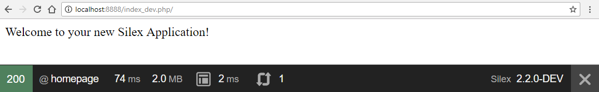
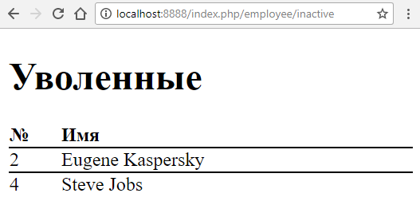

# Постановка задачи

С помощью фреймворка архитектуры MVC создать каждую из его составляющих: Модель, Представление и Контроллер.

# Ход работы

### 1

Устанавливаем фреймворк **Silex** через утилиту **Composer** с помощью командной строки:

```bash
composer create-project fabpot/silex-skeleton lab ~2.0
```

В текущей рабочей директории создастся папка *lab*, куда загрузится демо-приложение.

Переходим в данную папку:

```bash
cd lab
```

Запускаем встроенный PHP-сервер через **Composer**:


```bash
composer run
```

И проверяем, запуская в браузере ссылку http://localhost:8888/index_dev.php/

Если ошибок нет, мы увидим страницу-приветствие с текстом "**Welcome to your new Silex Application!**", а внизу debug-панель:



### 2

Приступим к разработке проекта!

Создаем базу данных - список сотрудников с указанием, работает ли он в данный момент или уволен. Можно воспользоваться готовым SQL-скриптом:

```sql
CREATE TABLE IF NOT EXISTS `employee` (
`id` int(11) NOT NULL,
  `name` varchar(128) NOT NULL,
  `status` enum('active','inactive') NOT NULL
) ENGINE=InnoDB  DEFAULT CHARSET=utf8;

INSERT INTO `employee` (`id`, `name`, `status`) VALUES
(1, 'Linus Torvalds', 'active'),
(2, 'Eugene Kaspersky', 'inactive'),
(3, 'Bill Gates', 'active'),
(4, 'Steve Jobs', 'inactive'),
(5, 'Sid Meier', 'active');

ALTER TABLE `employee` ADD PRIMARY KEY (`id`);
ALTER TABLE `employee` MODIFY `id` int(11) NOT NULL AUTO_INCREMENT;
```

Для того, чтобы подключаться к базе данных, будем использовать библиотеку **Doctrine DBAL**, устанавливаем её в папке проекта *lab*:

```bash
composer require doctrine/dbal:~2.2
```

Во фреймворке уже есть готовый класс для интеграции с данной библиотекой. Также, чтобы работать с базой MySQL, в файле *php.ini* следует включить данное расширение, раскомментировав строчку:

```ini
extension=php_pdo_mysql.dll
```

Добавим в файл *config/prod.php* следующие строки:

```php
$app['db.options'] = array_merge([
    'driver'    => 'pdo_mysql',
    'dbname'    => 'БД',
    'host'      => 'localhost',
    'user'      => 'ЛОГИН',
    'password'  => 'ПАРОЛЬ',
    'charset'   => 'utf8'
], isset($app['db.options']) ? $app['db.options'] : []);

$app->register(new Silex\Provider\DoctrineServiceProvider());
```

Параметры **БД**, **ЛОГИН** и **ПАРОЛЬ** необходимо вписать свои.

Здесь мы определили параметры для production-окружения и зарегистрировали класс для работы с БД в приложении.

Также мы воспользовались функцией слияния массивов *array_merge*, это необходимо для тех случаев, когда настройки на dev-окружении отличаются. К примеру, могут быть другие логин и пароль.

### 3

Теперь создадим наш обработчик - будем выводить список активных или уволенных сотрудников, в зависимости от передаваемого статуса в GET-параметре.

Добавляем в контроллер *src/controllers.php* следующие строки:

```php
$app->get('/employee/{status}', function ($status) use ($app) {
    $sql = 'SELECT * FROM employee WHERE status = ?';
    $employeeList = $app['db']->fetchAll($sql, [$status]);

    return $app['twig']->render('employees.html.twig', [
        'status'    => $status,
        'employees' => $employeeList,
    ]);
})
->assert('status', 'active|inactive') # допустимые значения для статуса
->value('status', 'active') # статус по умолчанию, когда сам GET-параметр не задан
;
```

Сначала мы формируем SQL-запрос с подстановкой параметра (статус), далее обращаемся к базе - производим выборку всех записей в ассоциативный массив.

После этого через шаблонизатор Twig рендерим HTML-представление. Создаем соответствующий файл *templates/employees.html.twig* и заполняем его:

```twig



    <h1>{{ status == 'active' ? 'Работают' : 'Уволенные' }}</h1>

    <table>
        <thead>
        <tr>
            <th>№</th>
            <th>Имя</th>
        </tr>
        </thead>
        <tbody>
        {# выводим весь список сотрудников #}
        
            <tr>
                <td>{{ employee.id }}</td>
                <td>{{ employee.name }}</td>
            </tr>
        
        </tbody>
    </table>

```

Первым параметром мы передаем адрес шаблона, а вторым - массив параметров, которые будут доступны в данном шаблоне по имени - ключам массива.

Через конструкцию **extends** шаблон рендерит сначала более общий шаблон *layout.html.twig*, в котором заменяет блок *content* через конструкцию **block**, а далее - содержимое этого блока.

В примере использованы тернарный оператор (**?:**), цикл (****), вывод (**{{ }}**) и комментарий (**{# #}**).

### 4

Немного визуально улучшим отображение шаблона. В общем шаблоне *templates/layout.html.twig* мы видим подключение CSS-файла, который находится по адресу *web/css/main.css*. Добавим немного красоты:

```css
table {
    width: 100%;
    text-align: left;
    border-spacing: 0;
}

table td {
    border-top: 1px solid black;
}
```

Теперь проверим, что все работает. Заходим по ссылке http://localhost:8888/index.php/employee/inactive и видим 2-х уволенных сотрудников:



А активных сотрудников мы можем посмотреть по ссылкам:

1. http://localhost:8888/index.php/employee/active
1. http://localhost:8888/index.php/employee

# Вывод

В ходе данной лабораторной работы на практике создали полноценное MVC-приложение, работающего с базой данных.